# pip-termination.html 使用说明

在线访问地址：https://vistart.github.io/examples/tools/pip-termination.html

## 第一步：配置大模型

首次使用本工具时，需要先配置大语言模型（LLM）API，以便启用 AI 生成方案、法律咨询等功能。

### 操作步骤

1. 打开 `pip-termination.html` 文件
2. 在页面顶部的 **API 配置面板** 中，填写以下信息：

| 配置项 | 填入内容 |
|--------|----------|
| OpenRouter API Key | `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` |
| 模型名称 | `z-ai/glm-4.5-air:free` |

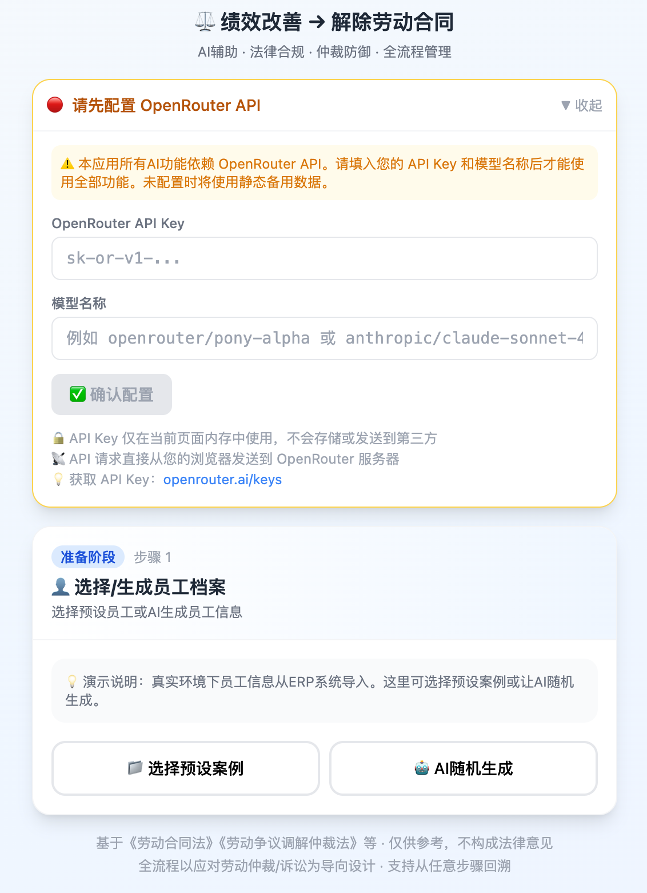

3. 点击 **确认配置** 按钮

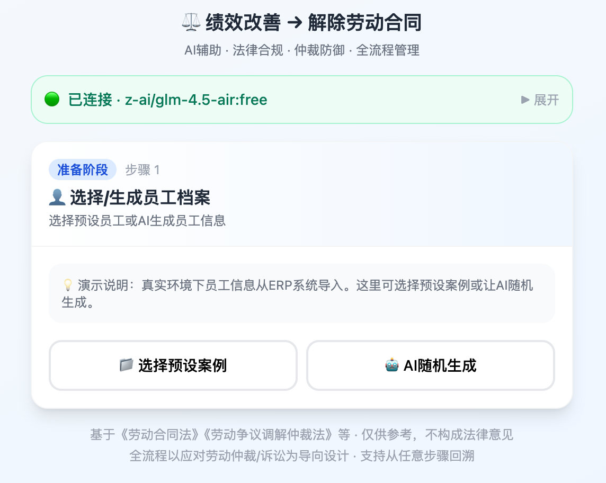

### 配置成功后

- 面板会从红色（未配置）变为绿色（已连接）
- 显示已连接的模型名称
- 即可进入下一步：选择员工档案

### 注意事项

- **⚠️ 免费模型说明**：当前配置的 `z-ai/glm-4.5-air:free` 为免费模型，稳定性和速度可能不佳，因此 **仅做演示用途**。未来企业级应用时会购买稳定可靠的模型服务。
- API Key 仅在当前页面内存中使用，不会存储或发送到第三方
- API 请求直接从浏览器发送到 OpenRouter 服务器
- 如需获取自己的 API Key，请访问 [openrouter.ai/keys](https://openrouter.ai/keys)

---

## 第二步：选择员工档案

配置成功后，进入 **选择员工档案** 页面。你有两种方式选择员工：

### 方式一：选择预设案例

点击 **📁 选择预设案例**，从 6 个预设的员工案例中选择。预设案例涵盖不同场景：

| 案例 | 职位 | 绩效评级 | 特殊标记 |
|------|------|----------|----------|
| 张明远 | 高级产品经理(P7) | B+→B→C+→C | 有期权、竞业限制 |
| 李思琪 | 营销总监(P8) | B→C+→C→C | 有期权、竞业限制 |
| 王浩然 | 架构师(P8) | A→B+→C→C+ | 有期权、竞业限制 |
| 陈雅婷 | 运营经理(P6) | B→B→C+→C | **三期女职工** |
| 刘建国 | 大客户总监(P7) | A→B→C→D | 有期权、竞业限制、**临退休** |
| 赵雪晴 | 数据分析师(P5) | C+→C→C→C | (无) |

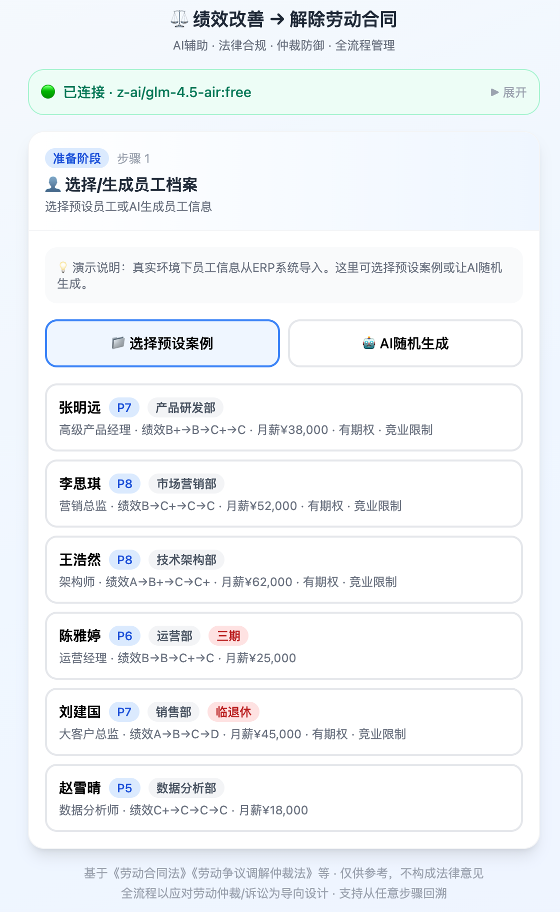

### 方式二：AI随机生成

点击 **🤖 AI随机生成**，让 AI 根据预设模板随机生成一个员工档案。点击后，系统会显示加载状态：

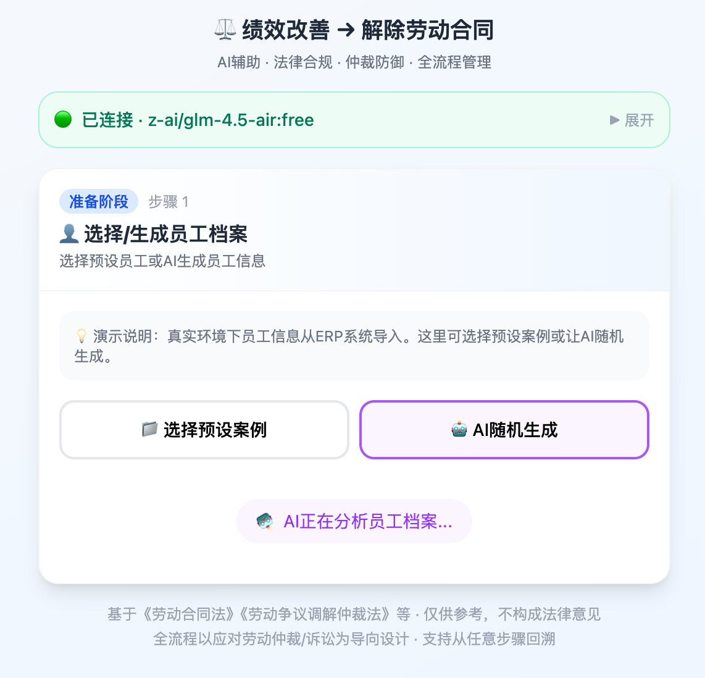

AI 生成完成后，会显示该员工的档案预览及 AI 分析摘要，包括：

- **员工基本信息**：姓名、职位、工龄、月薪、绩效评级
- **AI 分析摘要**：用 2-3 句话概括该员工绩效问题的核心表现
- **绩效问题**：具体绩效问题列表
- **预估解除成本**：N+1 标准金额
- **关键风险**：如工龄较长、补偿成本较高等
- **建议**：是否适合进入 PIP 流程

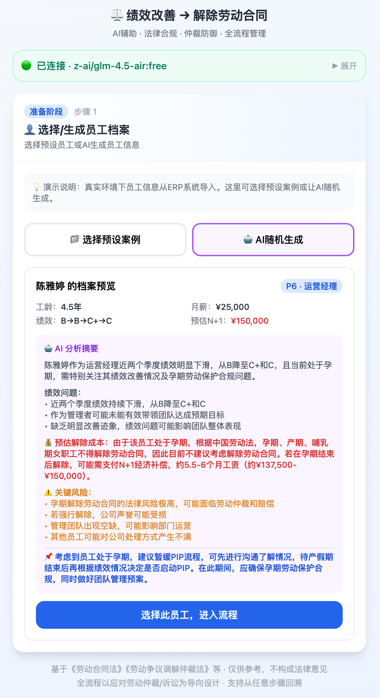

### ⚠️ 友情提示

- 受限于免费 AI 服务，AI 随机生成过程可能较慢或不稳定
- 如生成失败或长时间无响应，可多次点击 **AI随机生成** 按钮重试
- **不论是选择预设案例还是 AI 随机生成**，选定员工后，点击 **选择此员工，进入流程** 按钮继续下一步

---

## 第三步：员工信息确认与风险预评

选择预设案例（如张明远）后，进入 **员工信息确认与风险预评** 页面。系统会展示该员工的详细信息：

### 显示内容

- **ERP系统数据**：姓名、工号、部门、职位、入职日期、合同到期、月薪、工龄、近4季度绩效
- **解除成本预估**：N+1 法定标准金额、竞业限制成本（如有）、期权处理说明（如有）
- **特殊标记**：股权激励、竞业限制协议、管理团队、接触商业机密等
- **法定限制警告**：根据《劳动合同法》第42条，检测是否存在三期女职工、工伤职工、临退休等法定解除限制情形

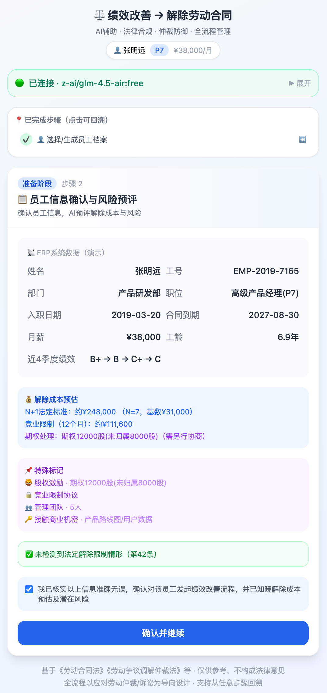

### 操作步骤

1. 核实页面显示的员工信息是否准确
2. 了解解除成本预估和潜在风险
3. 确认是否存在法定解除限制（如存在，系统会给出警告和建议）
4. 勾选确认选项："我已核实以上信息准确无误，确认对该员工发起绩效改善流程，并已知晓解除成本预估及潜在风险"
5. 点击 **确认并继续** 按钮

---

## 第四步：绩效问题认定

点击确认后，进入 **绩效问题认定** 页面。这是整个 PIP 流程的基础，需要明确绩效不达标的事实依据。

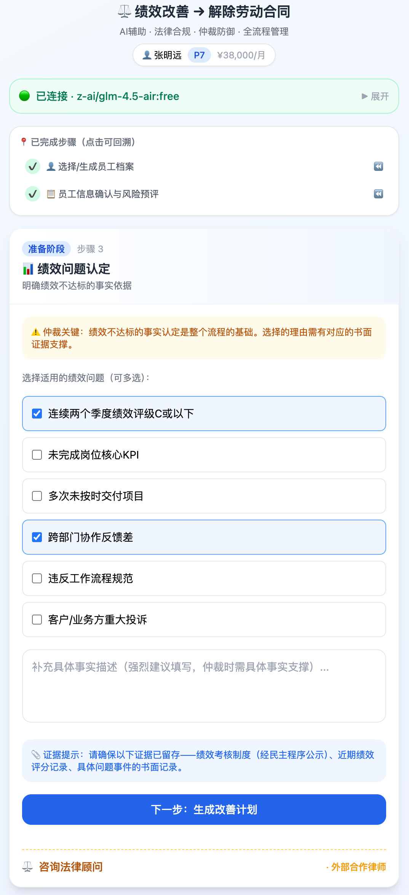

### ⚠️ 重要提示

仲裁关键：绩效不达标的事实认定是整个流程的基础。选择的理由需有对应的书面证据支撑。

### 可选问题（多选）

系统预设了以下常见的绩效问题，你可以根据实际情况勾选：

| 序号 | 绩效问题 | 说明 |
|------|----------|------|
| 1 | 连续两个季度绩效评级C或以下 | 绩效持续不达标 |
| 2 | 未完成岗位核心KPI | 关键业绩指标未达成 |
| 3 | 多次未按时交付项目 | 项目交付延期 |
| 4 | 跨部门协作反馈差 | 协作能力不足 |
| 5 | 违反工作流程规范 | 违规行为记录 |
| 6 | 客户/业务方重大投诉 | 客户反馈负面 |

### 补充说明

除勾选预设问题外，你还可以自行在下方文本框中 **补充具体事实描述**（强烈建议填写），仲裁时需具体事实支撑。

### 证据提示

系统会提示你需要留存的证据，包括：
- 绩效考核制度（经民主程序公示）
- 近期绩效评分记录
- 具体问题事件的书面记录

### 操作步骤

1. 勾选适用的绩效问题（可多选）
2. 在文本框中补充具体事实描述
3. 点击 **下一步：生成改善计划** 按钮

---

## 第五步：改善计划制定（PIP）

选择绩效问题后，进入 **改善计划制定** 页面。AI 会根据员工情况和选择的绩效问题，生成 3 个 PIP 方案供选择。

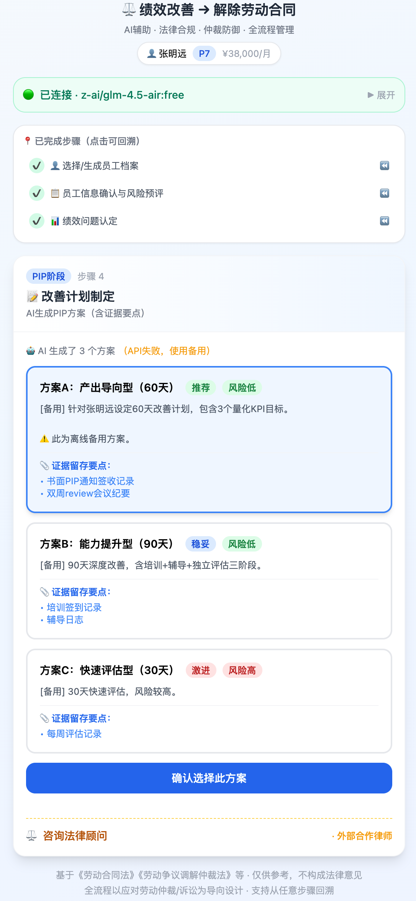

### AI 生成的方案

系统会生成 3 个不同特点的 PIP 方案：

| 方案 | 特点 | 周期 | 风险 | 说明 |
|------|------|------|------|------|
| 方案A | 产出导向型 | 60天 | 低 | 推荐：聚焦工作产出，适合大多数情况 |
| 方案B | 能力提升型 | 90天 | 低 | 稳妥：包含培训+辅导+独立评估 |
| 方案C | 快速评估型 | 30天 | 高 | 激进：快速得出结论，但风险较高 |

每个方案都包含：
- 具体的 KPI 目标
- 改善周期时长
- 评估方式
- 法律提示
- **证据留存要点**：该方案中应留存的关键证据（用于应对仲裁）

### 操作步骤

1. 查看 AI 生成的 3 个方案
2. 了解各方案的周期、风险和证据要点
3. 点击选择你想要的方案
4. 点击 **确认选择此方案** 按钮进入下一步

本示例选择 **方案A：产出导向型（60天）**。

---

## 第六步：通知送达

选择 PIP 方案后，进入 **通知送达** 页面。AI 会生成 2 个版本的通知书供选择。

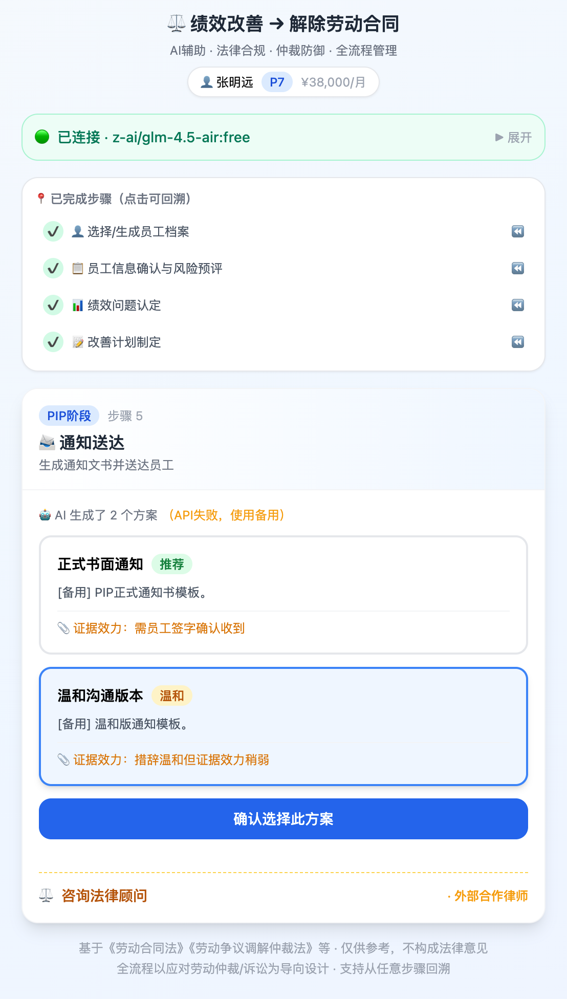

### AI 生成的通知版本

| 版本 | 特点 | 证据效力 | 适用场景 |
|------|------|----------|----------|
| 正式书面通知 | 正式措辞，包含完整法律要素 | 较高 | 常规流程，推荐使用 |
| 温和沟通版本 | 措辞委婉，便于员工接受 | 稍弱 | 维护关系，但需注意风险 |

每个版本都包含：
- 通知正文：改善原因、周期、目标、评估方式、签收要求、员工权利告知
- **证据效力说明**：该通知的仲裁证据效力分析
- **签收注意事项**：如何确保员工签收

### 操作步骤

1. 查看 AI 生成的 2 个通知版本
2. 了解各版本的证据效力和风险
3. 点击选择你想要的版本
4. 点击 **确认选择此方案** 按钮进入下一步

本示例选择 **温和沟通版本** 作为举例。

---

## 第七步：改善期跟踪

通知送达后，进入 **改善期跟踪** 页面。这是模拟记录 PIP 执行期间各项数据的环节。

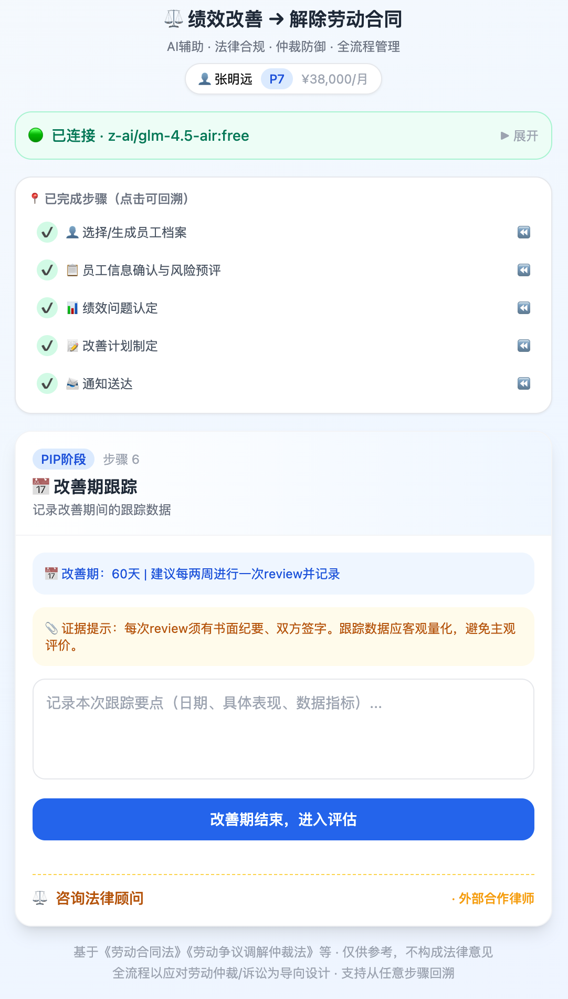

### 跟踪要点

系统模拟了以下几项跟踪记录：

| 项目 | 说明 |
|------|------|
| 书面PIP通知签收记录 | 记录员工是否签收PIP通知 |
| 双周review会议纪要 | 记录改善期间的review会议情况 |
| KPI完成进度 | 记录各KPI的完成情况 |
| 迟到早退/请假记录 | 记录考勤情况 |

### 操作步骤

1. 根据实际情况填写各项跟踪要点（可留空）
2. 如不填写，可直接点击进入下一步
3. 点击 **进入改善评估** 按钮

---

## 第八步：改善评估

改善期结束后，进入 **改善评估** 页面。AI 会生成 2 个可能的评估结论供选择。

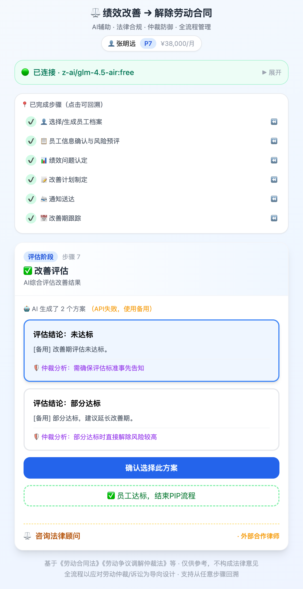

### AI 生成的评估结论

| 评估结论 | 说明 |
|----------|------|
| 评估结论：未达标 | 包含具体指标评估数据、综合评定、后续路径建议，引用劳动合同法 |
| 评估结论：部分达标 | 部分达标情况说明、延长改善期 vs 直接解除的风险对比 |

每个结论都包含：
- **仲裁分析**：该结论在仲裁中的证据效力分析和注意事项

### 两条路径

底部还有两个选项供选择：

| 选项 | 说明 |
|------|------|
| 员工达标，结束PIP流程 | 员工绩效改善达标，流程结束 |
| 员工未达标，进入解除流程 | 员工未达标，选择此选项进入解除路径 |

### 操作步骤

1. 查看 AI 生成的 2 个评估结论
2. 选择你认为合适的结论
3. 选择底部路径：达标结束 or 未达标进入解除
4. 点击 **确认选择此方案** 按钮

本示例选择 **评估结论：未达标** + **员工未达标，进入解除流程**。

---

## 第九步：路径决策

评估结束后，进入 **路径决策** 页面。根据评估结果，选择后续的处理路径。

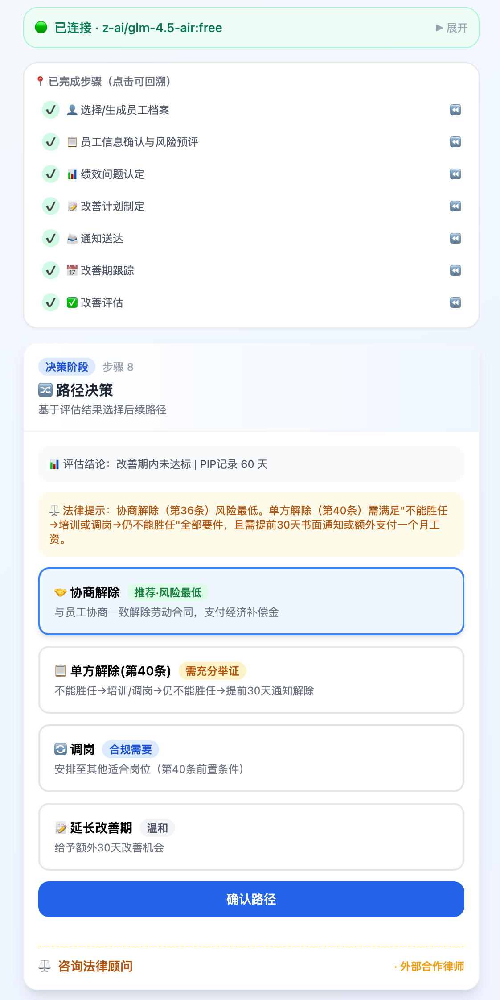

### 四个可选路径

| 路径 | 说明 | 风险 | 后续流程 |
|------|------|------|----------|
| 🤝 协商解除 | 与员工协商一致解除劳动合同，支付经济补偿金 | 推荐·风险最低 | 进入解除合规审查 → 生成文书 |
| 📋 单方解除(第40条) | 不能胜任→培训/调岗→仍不能胜任→提前30天通知解除 | 需充分举证 | 进入解除合规审查 → 生成文书 |
| 🔄 调岗 | 安排至其他适合岗位（第40条前置条件） | 合规需要 | 流程结束 |
| 📝 延长改善期 | 给予额外30天改善机会 | 温和 | 返回改善期跟踪 → 再次评估 |

### 法律提示

- 协商解除（第36条）风险最低
- 单方解除（第40条）需满足"不能胜任→培训或调岗→仍不能胜任"全部要件，且需提前30天书面通知或额外支付一个月工资

### 操作步骤

1. 了解各路径的特点和风险
2. 选择适合的路径
3. 点击 **确认路径** 按钮

本示例选择 **协商解除**。

---

## 第十步：解除合规审查

选择协商解除路径后，进入 **解除合规审查** 页面。这是法律风险控制的关键环节。

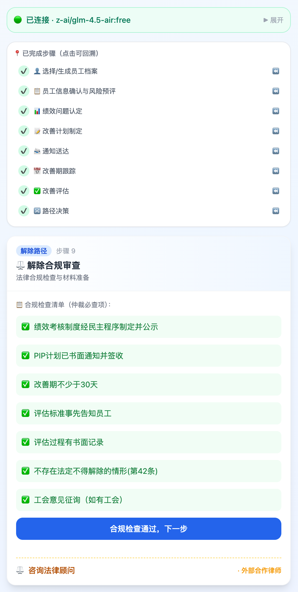

### 合规检查清单

系统会根据员工情况生成相应的合规检查清单，常见项目包括：

| 检查项目 | 说明 |
|----------|------|
| 劳动合同法依据 | 确认解除依据的合法性 |
| 解除程序合规性 | 通知、送达等程序是否完备 |
| 经济补偿计算 | 补偿金计算是否正确 |
| 竞业限制处理 | 是否启动/如何处理竞业限制 |
| 离职交接安排 | 工作交接是否完备 |
| 社保公积金 | 社保公积金停缴日期 |

### 特殊员工风险

不同员工可能有不同的合规要求：

- **三期女职工**：依据《劳动合同法》第42条，不得依据第40条解除
- **工伤职工**：需确认是否在医疗期
- **临退休员工**：距退休不足5年，依据第42条不得解除

### 操作步骤

1. 查看系统生成的合规检查清单
2. 确认各项合规要求
3. 如有问题，可咨询法律顾问
4. 点击进入下一步

---

## 第十一步：补偿方案

解除合规审查后，进入 **补偿方案** 页面。AI 会根据员工情况生成经济补偿方案。

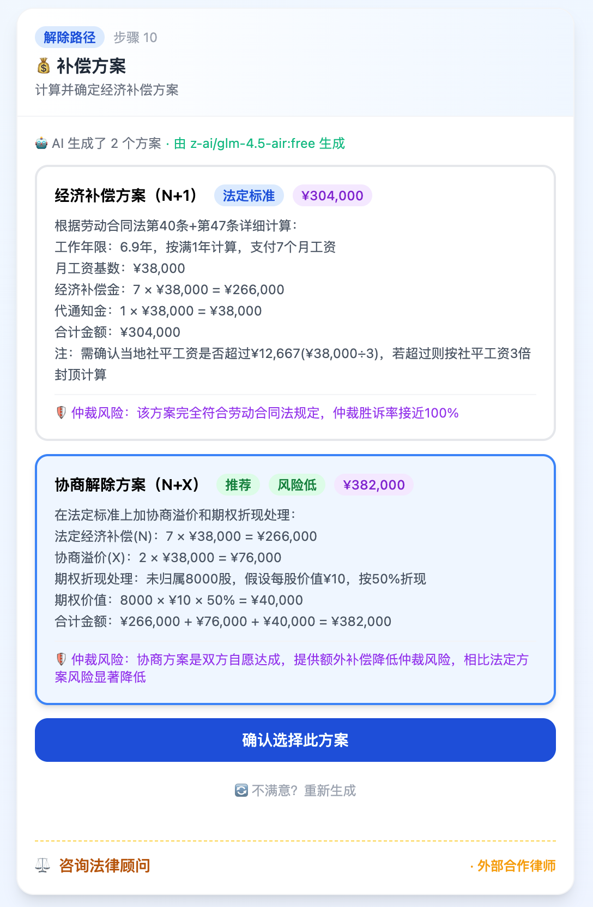

> ⚠️ 此步骤会调用 AI 生成方案，可能耗时较长，请耐心等待。

### AI 生成的补偿方案

| 方案 | 类型 | 说明 |
|------|------|------|
| 经济补偿方案（N+1） | 法定标准 | 根据《劳动合同法》第40条+第47条计算 |
| 协商解除方案（N+X） | 推荐 | 在法定标准上加协商溢价 |

每个方案都包含：
- **详细内容**：工作年限、月工资基数、代通知金、合计金额
- **社平工资3倍封顶规则**：说明封顶计算
- **具体金额**：计算后的补偿金额
- **仲裁风险评估**：该方案的仲裁胜诉率评估

### 操作步骤

1. 等待 AI 生成补偿方案
2. 查看各方案的补偿金额和风险评估
3. 选择适合的方案
4. 如对两个方案都不满意，可选择其一后点击 **重新生成** 按钮
5. 点击 **确认选择此方案** 按钮

本示例选择 **协商解除方案（N+X）**。

---

## 第十二步：特殊事项处理

补偿方案选择后，进入 **特殊事项处理** 页面。根据员工情况，可能涉及期权、竞业限制等特殊事项的处理。

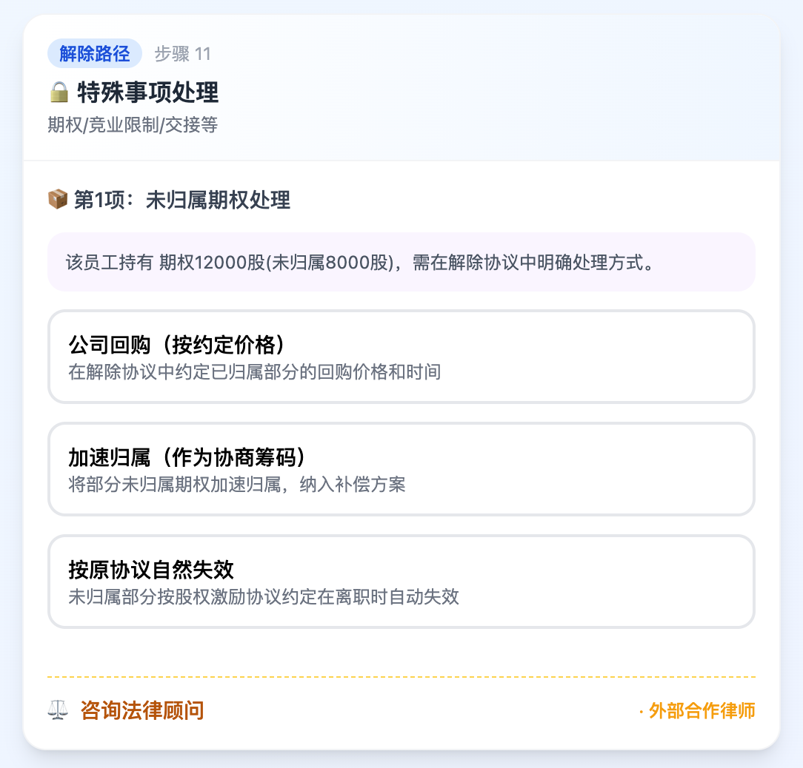

### 常见特殊事项

| 事项 | 说明 |
|------|------|
| 未归属期权 | 员工持有的股票期权/RSU 未归属部分如何处理 |
| 竞业限制协议 | 是否启动竞业限制，补偿金额如何约定 |
| 商业机密 | 接触核心商业机密的员工如何处理 |

### AI 生成的方案

根据张明远的情况（期权12000股，未归属8000股），AI 生成了 2 个竞业限制处理方案：

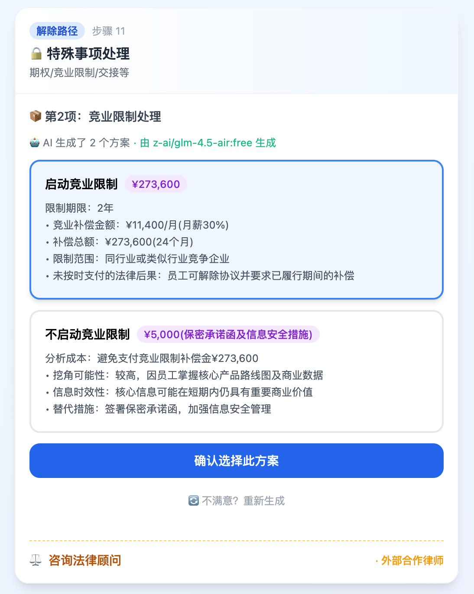

| 方案 | 说明 |
|------|------|
| 启动竞业限制（12个月） | 含限制期限、竞业补偿金额(不低于月薪30%)、补偿总额、限制范围 |
| 不启动竞业限制 | 分析成本、挖角可能性，信息时效性，建议替代措施如保密承诺函 |

每个方案都包含：
- **详细内容**：具体处理方式和法律要点
- **成本估算**：相关费用预估

### ⚠️ 友情提示

特殊事项不是每个员工都有的，页面会根据员工实际情况显示相关内容。部分员工可能只显示期权处理，部分可能只显示竞业限制处理，有些员工可能两者都有，有些可能都没有。

### 操作步骤

1. 根据员工情况查看特殊事项处理方案
2. 选择适合的方案
3. 如不满意，可点击 **重新生成** 按钮
4. 点击 **确认选择此方案** 按钮
5. 选择后会再次进入 AI 生成环节

本示例选择 **启动竞业限制**。

---

## 第十三步：仲裁风险评估

特殊事项处理后，进入 **仲裁风险评估** 页面。AI 会对整个流程进行全面的仲裁风险评估。

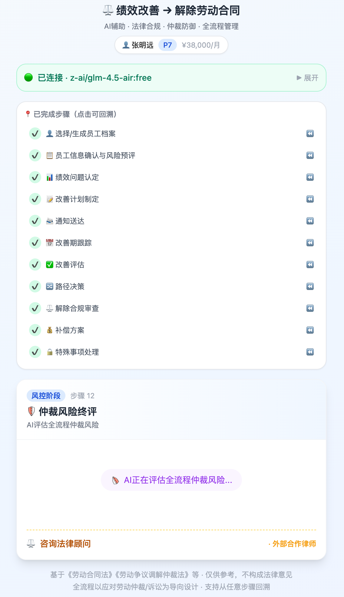

> ⚠️ 此步骤会调用 AI 进行综合评估，可能耗时较长，请耐心等待。

### 评估内容

AI 会根据以下信息进行综合评估：

- **员工情况**：姓名、职位、工龄、绩效记录
- **处理路径**：选择的解除方式
- **已采取步骤**：完整的 PIP 流程记录
- **法律顾问建议采纳情况**：各步骤的顾问建议采纳情况
- **特殊因素**：三期女职工、临退休、期权、竞业限制等

### 评估结果

评估完成后会显示：

- **整体仲裁风险等级**：高/中/低
- **预估企业胜诉率**：百分比
- **关键风险点**：各风险点的严重程度和缓解建议
- **必要证据清单**：需要准备的证据列表
- **综合评估摘要**：200字左右的综合分析

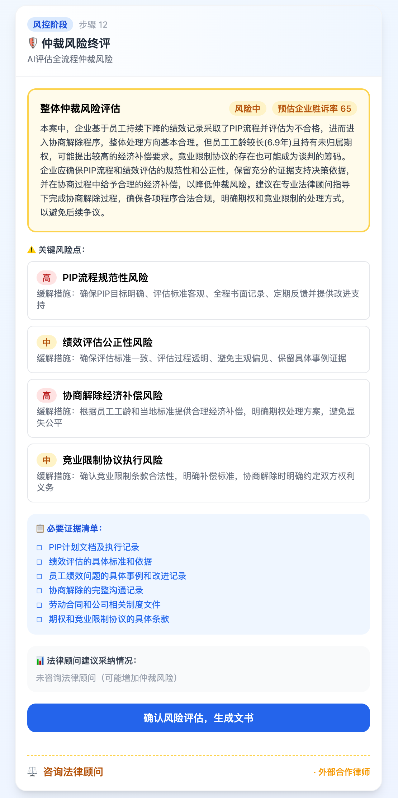

### 操作步骤

1. 等待 AI 生成评估报告
2. 查看整体风险等级和胜诉率
3. 阅读关键风险点和缓解建议
4. 核对必要证据清单
5. 确认无误后，点击 **确认风险评估，生成文书** 按钮进入下一步

---

## 第十四步：文书生成

仲裁风险评估确认后，进入 **文书生成** 页面。系统会生成一套完整的法律文书。

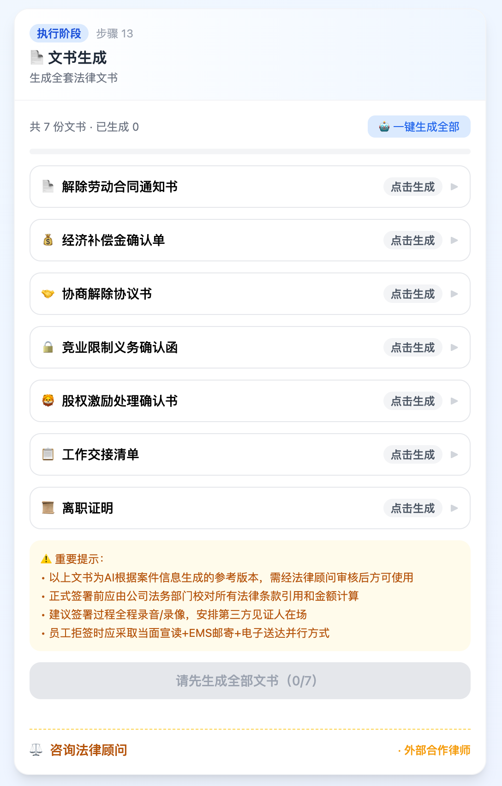

### 待生成的文书

根据选择的方案，系统会生成以下文书：

| 文书 | 说明 |
|------|------|
| 协商解除劳动合同协议书 | 双方协商一致的解除协议 |
| 离职证明 | 离职证明文件 |
| 竞业限制协议 | 如适用，竞业限制相关协议 |
| 工作交接清单 | 工作交接事项清单 |
| 解除劳动合同证明书 | 社保用的解除证明 |

### 操作步骤

1. 查看待生成的文书列表
2. 由于 AI 生成可能会限速，建议 **逐个点击** 每个文书旁边的 **"点击生成"** 按钮
3. 不建议点击"一键生成全部"，以免触发限速
4. 每个文书生成后可以查看和复制内容
5. 全部生成完成后，流程结束

### ⚠️ 友情提示

- 每个文书的生成耗时可能较长，请耐心等待
- 如果生成失败，重新点击 **"点击生成"** 按钮即可
- 如果生成成功但内容不满意，也可以随时点击 **重新生成** 按钮
- **一键生成** 按钮会按顺序生成尚未生成的文书，生成过程中也可以随时停止，改为手动生成单个文书

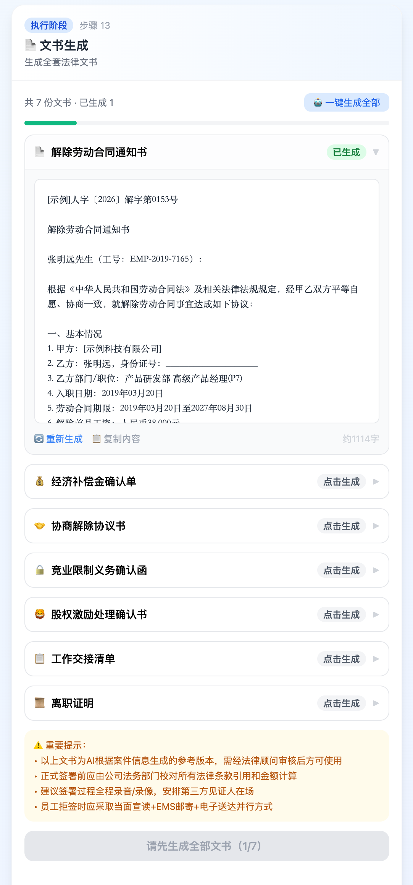

---

## 流程结束

确认生成全部文书以后，所有流程即结束。

> ⚠️ **数据不保存**：上述所有演示都在浏览器内进行，**没有保存到任何服务器**，关闭网页后数据即消失。如需保存，请手动复制生成的文书内容。

---

## 附录：法律顾问咨询功能

在流程的各个步骤中，页面底部会有 **"咨询法律顾问"** 按钮。点击后，系统会模拟外部律师给出专业法律建议。

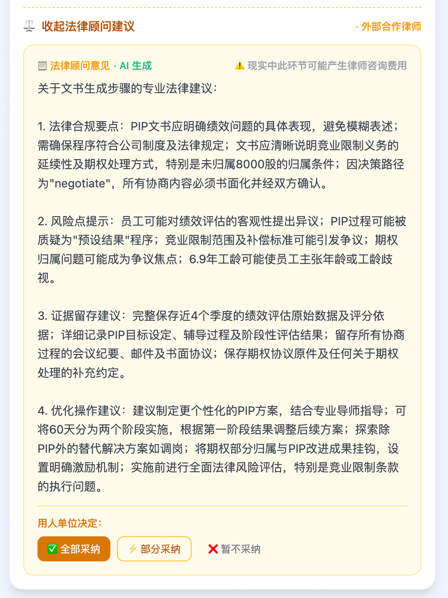

### 功能说明

- **AI 生成回复**：法律顾问的建议同样由 AI 生成，耗时可能较长，请耐心等待
- **建议内容**：包含当前步骤的法律合规要点、可能引发仲裁的风险点、证据留存建议等
- **用人单位决定**：收到建议后，你可以选择 **全部采纳** / **部分采纳** / **暂不采纳**
- **不影响流程**：无论采纳与否，**此功能不影响前述步骤的结果**，仅作为参考

### ⚠️ 友情提示

- 现实中此环节可能产生律师咨询费用
- 建议在关键步骤（如路径决策、解除合规审查等）咨询法律顾问

---

## 附录：Token 与费用预估

### 什么是 Token？

Token 是大语言模型处理文本的基本单位。简单理解：
- 1 个 Token ≈ 1-2 个中文字符 ≈ 0.75 个英文单词
- 输入和输出都消耗 Token，都需要付费

### 本轮演示 Token 统计

根据 `openrouter_activity_2026-02-27.csv` 记录，本轮演示共进行了 **16 次 AI 生成**：

| 统计项 | 数量 |
|--------|------|
| 总输入 Token (prompt) | ~4,454 |
| 总输出 Token (completion) | ~22,059 |
| 总 Token | ~26,513 |

> ⚠️ 说明：本轮演示没有失败情况，也没有流程回溯，是最小费用情况。实际使用中可能因生成失败重试、流程回溯调整等因素导致费用增加。

### 典型模型费用预估

以下以 **DeepSeek**、**MiniMax M2.5**、**GLM-5**、**Qwen3.5-plus** 等典型模型为例，预估单次生成（~1,650 Token）的成本：

| 模型 | 输入价格 (美元/百万Token) | 输出价格 (美元/百万Token) | 单次生成成本 |
|------|--------------------------|--------------------------|--------------|
| DeepSeek V3 | $0.07 | $0.27 | ~$0.0005 |
| MiniMax M2.5 | $0.12 | $0.60 | ~$0.0011 |
| GLM-5 | $0.10 | $0.50 | ~$0.0009 |
| Qwen3.5-plus | $0.20 | $0.60 | ~$0.0012 |

> 💡 **估算方法**：单次生成成本 ≈ (输入Token × 输入单价 + 输出Token × 输出单价) / 1,000,000
>
> 以本演示 16 次生成、总计 ~26,513 Token 估算，总成本约 **$0.01 ~ $0.02 美元**（约人民币 0.07~0.14 元）。

### 费用优化建议

- **模板文档**：对于《离职证明》《工作交接清单》等格式固定的文档，可以预设模板，仅让 AI 填充关键信息（如姓名、日期、金额），大幅减少 Token 消耗
- **缓存机制**：对于相同场景的重复生成（如相同职位的 PIP 方案），可考虑缓存结果
- **选择合适的模型**：简单场景可用小模型（如 GLM-4-flash），复杂场景再用高级模型

---

## 附录：完整流程一览

| 步骤 | 名称 | 说明 |
|------|------|------|
| 1 | 配置大模型 | 配置 OpenRouter API |
| 2 | 选择员工档案 | 预设案例或 AI 生成 |
| 3 | 员工信息确认与风险预评 | 核实信息，了解风险 |
| 4 | 绩效问题认定 | 选择绩效问题理由 |
| 5 | 改善计划制定(PIP) | AI 生成 3 个方案 |
| 6 | 通知送达 | AI 生成 2 个版本 |
| 7 | 改善期跟踪 | 记录跟踪数据 |
| 8 | 改善评估 | AI 评估结果 |
| 9 | 路径决策 | 协商/单方/调岗/延长 |
| 10 | 解除合规审查 | 合规检查清单 |
| 11 | 补偿方案 | AI 计算补偿金 |
| 12 | 特殊事项处理 | 期权/竞业限制 |
| 13 | 仲裁风险评估 | AI 综合评估 |
| 14 | 文书生成 | 生成全套法律文书 |
